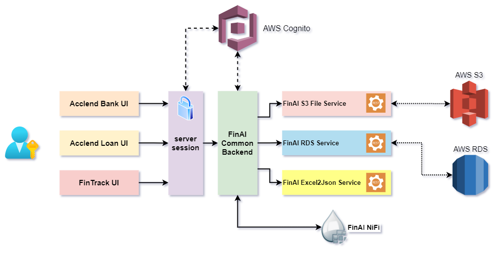

# Introduction
The intent of this Developer Guide is to provide the reader with the information needed to understand how FinAI Stack is architected, implemented and extended. It provides an introduction and detailed information about each of the applications in FinAI Stack and the API used in the development.

# FinAI Stack
## Overview
FinAI Stack contains several applications, which serve different purposes. We at FinAI adhere to microservice architecture.

Applications in the stack are listed below:
* AccLend Bank UI
* AccLend Loan UI
* FinTrack UI
* FinAI Backend Service
* FinAI S3 File Service
* FinAI RDS Datastore Service
* FinAI ExcelToJson Service
* FinAI NiFi

## Tech Stack

### Development
We are using *Javascript* as our primary language for application development. Frontend is written in [React JS](https://reactjs.org/) and Backend is written in [NodeJS](https://nodejs.org). We also use [Apache NiFi](https://nifi.apache.org/) as an orchestration engine for asynchronous and data intensive processes.

### Deployment
Currently, we are using Docker and Docker Compose for deploying and running our applications. (We have plans to move to Kubernetes soon!). In our `docker-compose.yml` we have all the above mentioned applications, except NiFi, and in addition to that, we have a Nginx Reverse Proxy docker container as well.

## Architecture
Below is the architecture diagram

## Component Details
Here we will describe about each components (application) in our stack. This will be a mid level overview, for detailed docs please refer to respective repository Readme files.

### AWS Cognito
We use AWS Cognito for user management and also as user access and security management tool. Cognito provides OAuth2.0 ID Provider to be used as SSO provider for our applications. Cognito also provides easy user management.

End user can only access FinAI resources (web-views/APIs) after successfully authenticating against AWS Cognito Userpools.

#### Backend Integration
FinAI Backend Service is where all the secure exchange happens related to Cognito. When a user logs in via AWS Cognito SSO, backend handles the oauth callback, and issues a JWT for that user. JWTs are never shared with the frontend, instead a session is maintained on the server side, which contains the auth information for that user. 

### FinAI Backend Service
This is the most crucial piece of the entire stack. This acts as the middleware for cognito and serves as a full backend RESTful server for all the frontend applications.

Application runs on port **9101** by default. Please see [Backend API](#backend-api) for available APIs.

Because this is a single application serving as backend for multiple UIs, which might be using separate Cognito Userpool, we need to configure this app with all the required ENVs and initial config values, for multiple Userpools.

#### Login Sequence
We are using the [Authorization Code](https://developer.okta.com/blog/2018/04/10/oauth-authorization-code-grant-type) grant type of standard OAuth2.0 protocol. This is provided by AWS Cognito.

1. User initiates a login request to *FinAI Backend*
2. Backend redirects to Authorization URL for provided application client.
3. User is prompted for username and password on browser screen.
4. On successful submission of login details, a callback is received by FinAI Backend. Along with it is the Authorization Code.
5. Backend, exchanges this Authorization Code along with `client_secret` for a set of tokens.
6. On successful exchange we get back `access_token`, `id_token` and `refresh_token`.
7. Backend app saves these tokens to the user's session.
8. Every request from frontend is then authenticated using a session cookie and stored tokens. 

#### SignUp Sequence
SignUp sequence is same as login with an additional step of user signup. After user signup, above mentioned login sequence is followed.

#### Logout Sequence
Logout is a crucial part of users' session. There are multiple things that needs to be handled during logout process.
1. Removing user info from session.
2. Revoking refresh token.
3. Handling Cognito `/logout` route.
